#  Elastic SIEM Dashboards (Failed Login Monitoring)

##  Introduction

This document focuses on building and analyzing **failed login monitoring dashboards** using the Elastic SIEM stack. It demonstrates how to simulate real-world attack scenarios and visualize security events for effective threat detection.

In this lab, we generate failed authentication attempts through controlled brute-force activity and capture these events using Winlogbeat. The logs are then ingested into Elasticsearch and visualized in Kibana to provide actionable insights.

The goal is to help security analysts:

* Detect brute-force attacks in real time
* Identify suspicious login patterns
* Monitor attacker behavior through log analysis
* Build meaningful dashboards for SOC operations

This hands-on approach bridges the gap between attack simulation and defensive monitoring, making it ideal for learning practical SIEM and threat hunting skills.

---

##  Attack Simulation

* Use Hydra to Bruteforce RDP Login Credentials

```bash
hydra -L /usr/share/wordlists/SecLists-master/Usernames/top-usernames-shortlist.txt -P /usr/share/wordlists/SecLists-master/Passwords/Leaked-Databases/rockyou-05.txt rdp://Target-IP:3389 -t 16 -I -V
```

---

##  Creating a Dashboard for Failed Login Attempts

### 1. Create Visualization

* Visting the dashboard page
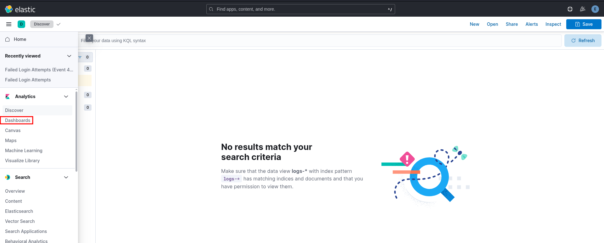

* Creating new dashboard
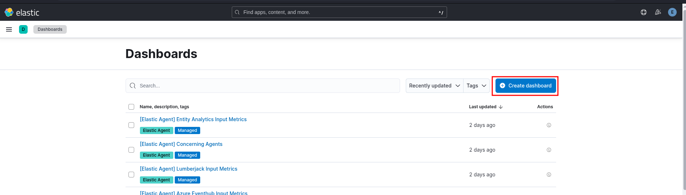

* Creating visualization
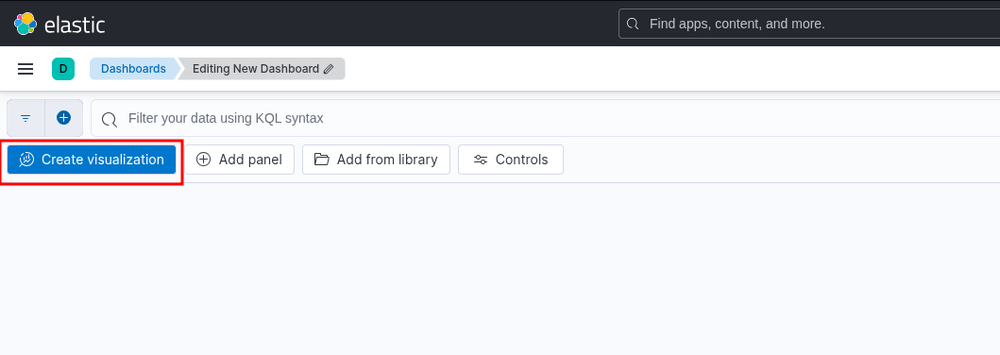

---
### 2. Add Filter

* Adding Filter (In our case event code 4625)
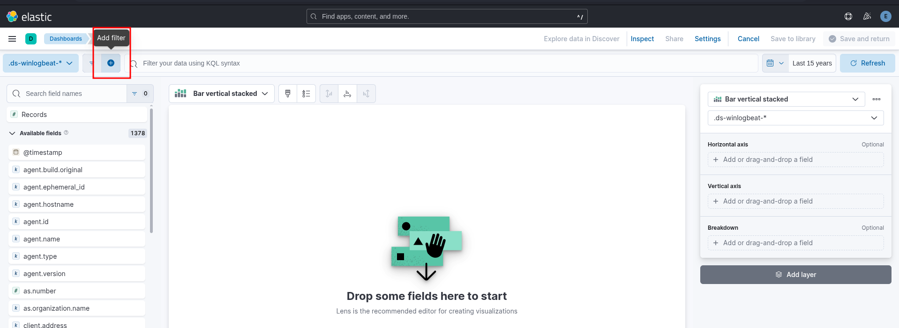
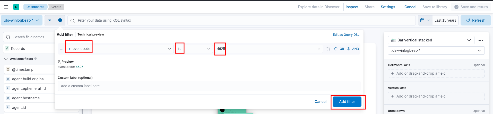

---
### 3. Configuring visualization type and Data view
* Choosing Table for Visualization Type
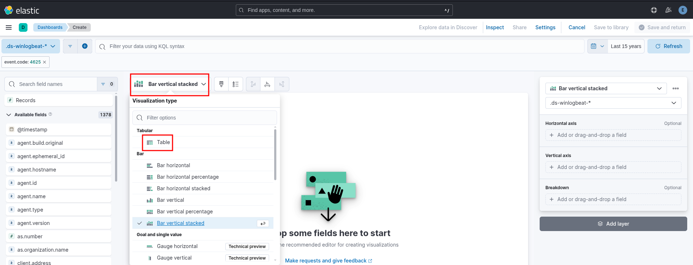

* Selecting winlogbeat data view
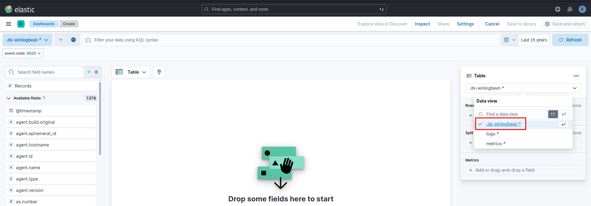

---
### 4. Add Fields
* Click on `Add or drag-and-drop a field`
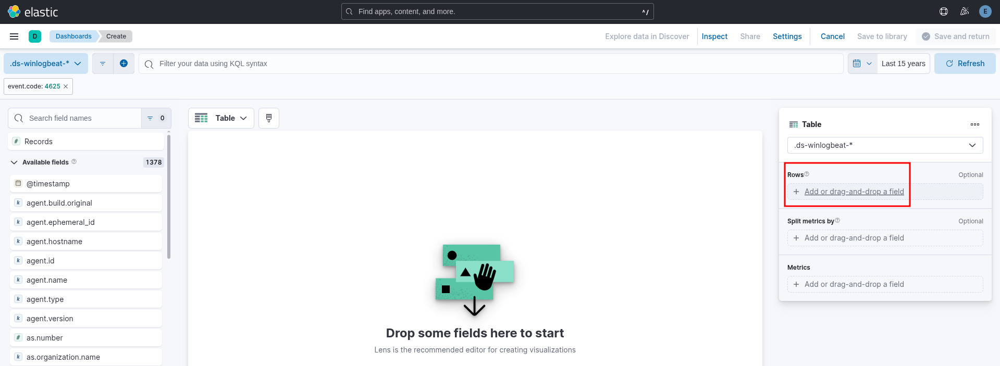

* Adding the field `winlog.event_data.TargetUserName`
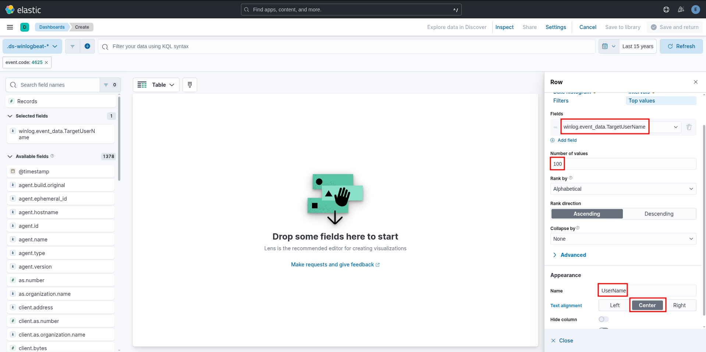

* Adding metrics (count: Number of Login attempts)
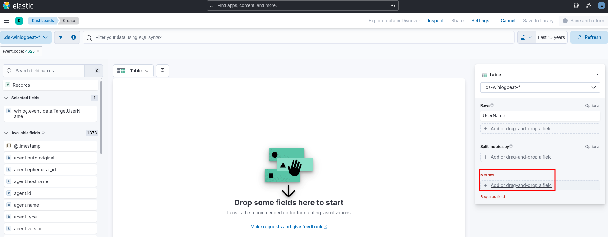
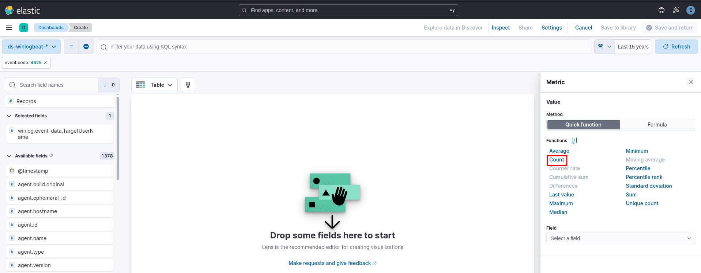
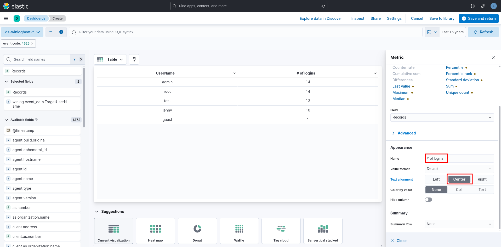

* Adding the field `host.hostname`
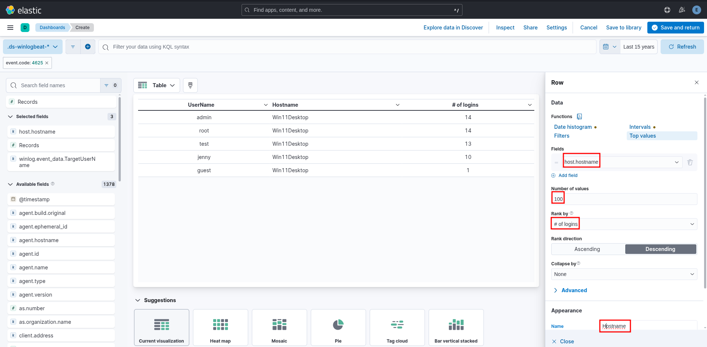

* Adding the field `winlog.event_data.LogonType`
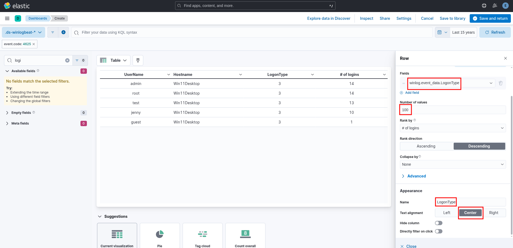


---
### 4. Save Visualization
* Click on `Save and return` 
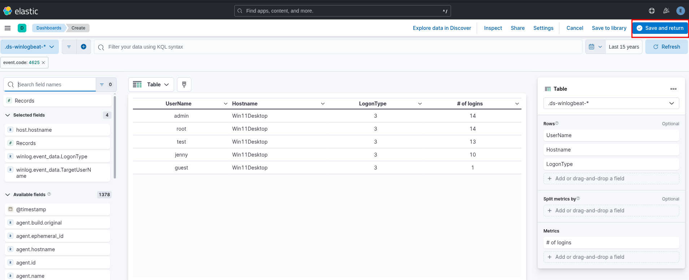

* Click on `Save`
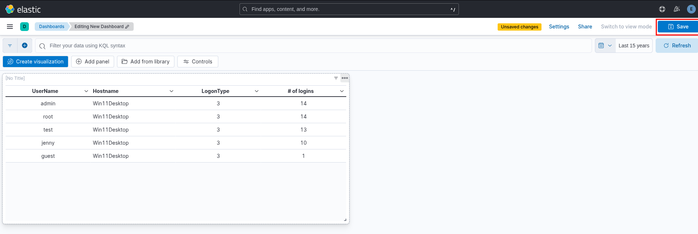

* Give name for the dashboard and click on  `Save`
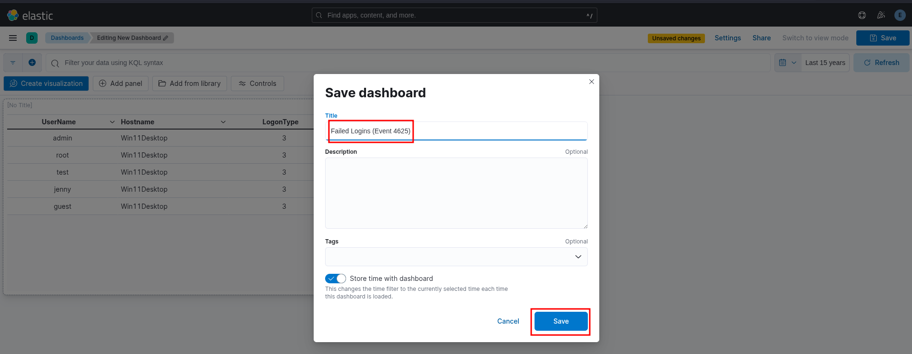


## Refining The Visualization
Suppose the SOC Manager suggested adding the source IP Address to the dashboard

* Click on `Edit Visualization`
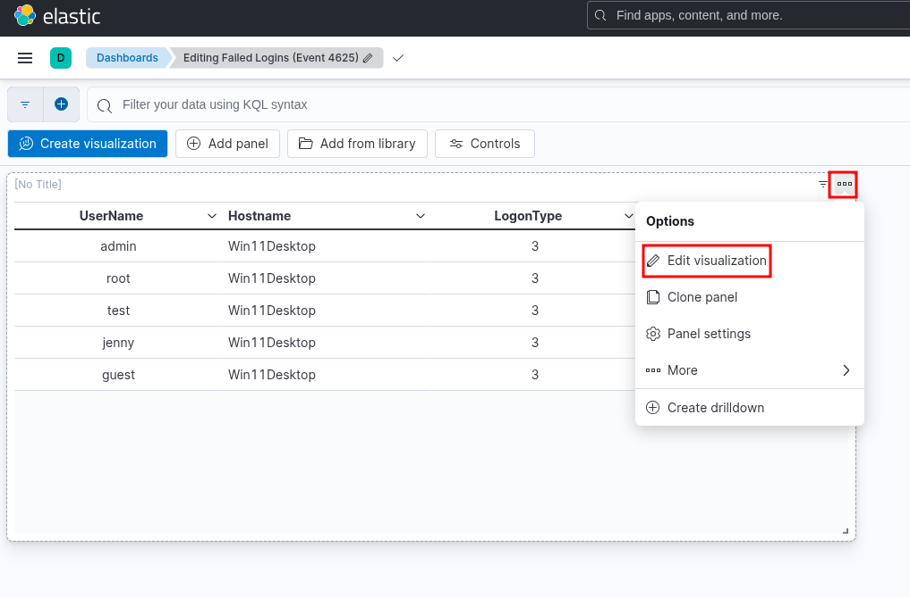


* Adding the field `winlog.event_data.IpAddress`
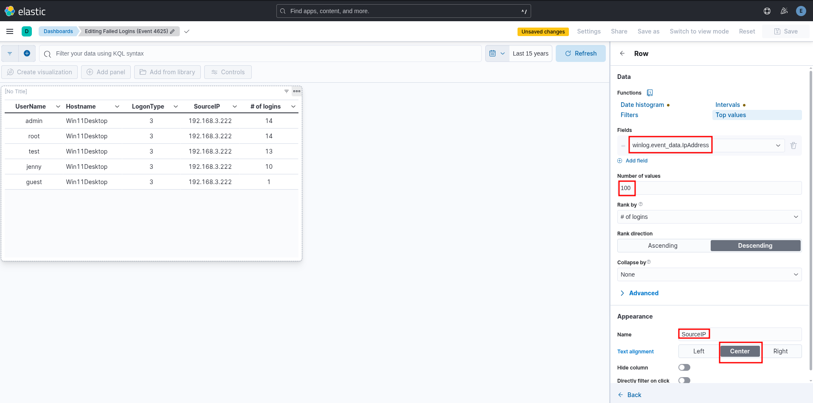

* Apply the new changes and save
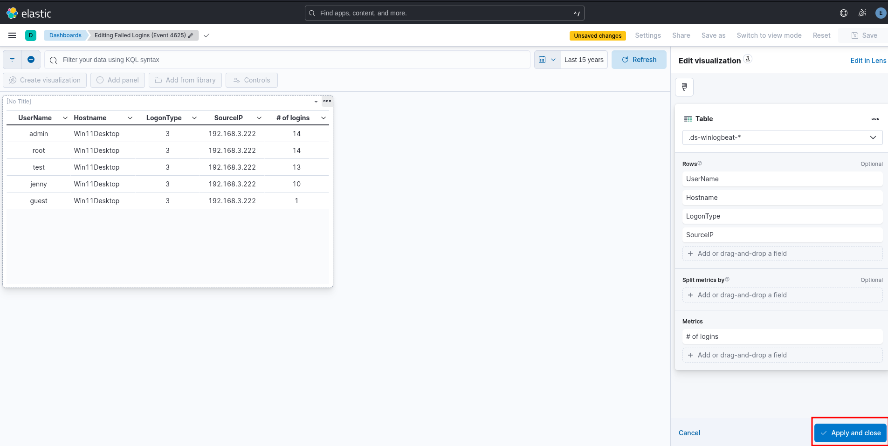
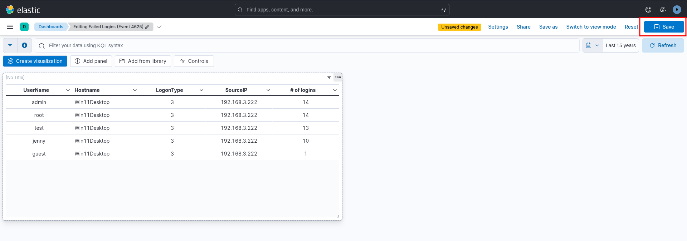


---

##  Outcome

This lab allows you to:
* Simulate real-world attacks
* Build SOC-level dashboards
* Detect Failed Login Attempts
* Detect suspicious activity
