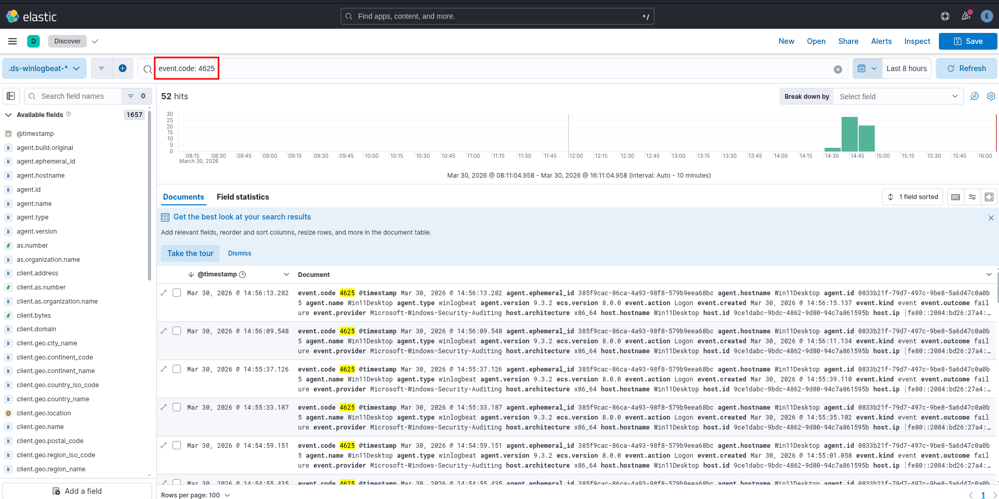

#  Elastic SIEM SOC Lab

##  Overview

This project demonstrates a hands-on **Security Operations Center (SOC) lab** built using the Elastic Stack for monitoring, detection, and threat hunting.

---

##  What is SIEM?

**SIEM (Security Information and Event Management)** is a solution that collects, analyzes, and correlates logs from multiple sources in real time to detect suspicious activity and security threats.

Key capabilities:

* Log aggregation
* Real-time monitoring
* Threat detection
* Incident response

---

##  What is Elastic?

**Elastic (Elastic Stack / ELK Stack)** is a powerful open-source platform used for search, analytics, and visualization.

It includes:

* **Elasticsearch** → Data storage and search engine
* **Logstash / Beats** → Data collection and ingestion
* **Kibana** → Data visualization and dashboards

---

##  Lab Environment

This SOC lab consists of three main machines:

###  Ubuntu Server (SIEM Server)

* Hosts:

  * Elasticsearch
  * Kibana
* Responsible for storing and analyzing logs

---

###  Windows 11 Workstation (Victim Machine)

* Configured with:

  * **Winlogbeat** (running as a service)
* Sends Windows event logs to Elasticsearch

---

###  Attacker Machine (Kali Linux)

* Used to simulate attacks
* Generates logs (e.g., failed login attempts)

---

##  Setup: Installing Elastic Stack with Docker

### 1. Install Docker

```bash
sudo apt update
sudo apt install docker.io -y
sudo systemctl enable docker
sudo systemctl start docker
```

---

### 2. Create the Elastic Stack using Docker

```bash
docker compose up -d
```


---


##  Beat Setup: Installing winlogbeat Service

### 1. Download Winlogbeat
Winlogbeat can be downloaded from [winlogbeat-9.3.2-windows-x86_64.zip](https://artifacts.elastic.co/downloads/beats/winlogbeat/winlogbeat-9.3.2-windows-x86_64.zip)


### 2. Install winlogbeat Service
* Extract winlogbeat-9.3.2-windows-x86_64.zip
* Open cmd as administrator and run the powershell script:
```bash
c:\Users\REDACTED\Downloads\winlogbeat-9.3.2-windows-x86_64> dir
 Le volume dans le lecteur C n’a pas de nom.
 Le numéro de série du volume est CC1A-F90E

 Répertoire de c:\Users\REDACTED\Downloads\winlogbeat-9.3.2-windows-x86_64> dir

29/03/2026  18:57    <DIR>          .
29/03/2026  17:58    <DIR>          ..
29/03/2026  17:58                41 .build_hash.txt
29/03/2026  19:05    <DIR>          data
29/03/2026  17:58           413 715 fields.yml
29/03/2026  17:58             3 224 install-service-winlogbeat.ps1
29/03/2026  17:58    <DIR>          kibana
29/03/2026  17:58            13 675 LICENSE.txt
29/03/2026  18:57    <DIR>          logs
29/03/2026  17:58    <DIR>          module
29/03/2026  17:58         4 757 457 NOTICE.txt
29/03/2026  17:58               832 README.md
29/03/2026  17:58               298 uninstall-service-winlogbeat.ps1
29/03/2026  17:58       117 241 824 winlogbeat.exe
29/03/2026  17:58            67 657 winlogbeat.reference.yml
29/03/2026  18:58             7 758 winlogbeat.yml
              10 fichier(s)      122 506 481 octets
               6 Rép(s)  42 238 472 192 octets libres
```            


### 3. Update winlogbeat.yml to configure winlogbeat service
```yml
# ======================== Winlogbeat specific options =========================

# event_logs specifies a list of event logs to monitor as well as any
# accompanying options. The YAML data type of event_logs is a list of
# dictionaries.
#
# The supported keys are name, id, xml_query, tags, fields, fields_under_root,
# forwarded, ignore_older, level, event_id, provider, include_xml, and 
# ignore_missing_channel.
# The xml_query key requires an id and must not be used with the name,
# ignore_older, level, event_id, or provider keys. Please visit the
# documentation for the complete details of each option. Query filters in
# custom XML queries are not always reliable across all Windows versions and
# forwarding scenarios.
# https://go.es.io/WinlogbeatConfig

winlogbeat.event_logs:
  - name: Application
    ignore_older: 72h

  - name: System

  - name: Security
    event_id: 4624, 4625, 4700-4800, 5140, 5142, 5157

  - name: Microsoft-Windows-Sysmon/Operational

  - name: Windows PowerShell
    event_id: 400, 403, 600, 800

  - name: Microsoft-Windows-PowerShell/Operational
    event_id: 4103, 4104, 4105, 4106

  - name: ForwardedEvents
    tags: [forwarded]

# ================================== Outputs ===================================

# Configure what output to use when sending the data collected by the beat.

# ---------------------------- Elasticsearch Output ----------------------------
output.elasticsearch:
  # Array of hosts to connect to.
  hosts: ["SIEM-SERVER-IP:9200"]

  # Protocol - either `http` (default) or `https`.
  #protocol: "https"

  # Authentication credentials - either API key or username/password.
  #api_key: "id:api_key"
  username: "elastic"
  password: "changeme"

  # Pipeline to route events to security, sysmon, or powershell pipelines.
  #pipeline: "winlogbeat-%{[agent.version]}-routing"
```

### 4. Starting winlogbeat Service
```bash
C:\Users\REDACTED> powershell "start-service winlogbeat"
C:\Users\REDACTED> powershell "get-service winlogbeat"

Status   Name               DisplayName
------   ----               -----------
Running  winlogbeat         winlogbeat
```


```
http://localhost:5601
```

---

## Threat Hunting Example

### Detect Failed Logon Attempts (Event ID 4625)

Windows Event ID **4625** indicates a **failed login attempt**.

### Access Kibana
```
http://SIEM-SERVER-IP:5601
```


###  Search in Kibana (KQL)

```kql
event.code: "4625"
```


---

###  Useful Fields

* `winlog.event_data.TargetUserName`
* `source.ip`
* `host.name`

---

###  Use Case

Detect:

* Brute force attacks
* Unauthorized access attempts
* Suspicious login behavior

---


##  Outcome

This lab allows you to:

* Simulate real-world attacks
* Collect and analyze logs
* Detect suspicious activity
* Build SOC-level dashboards

---


##  Author

BCH-Security
